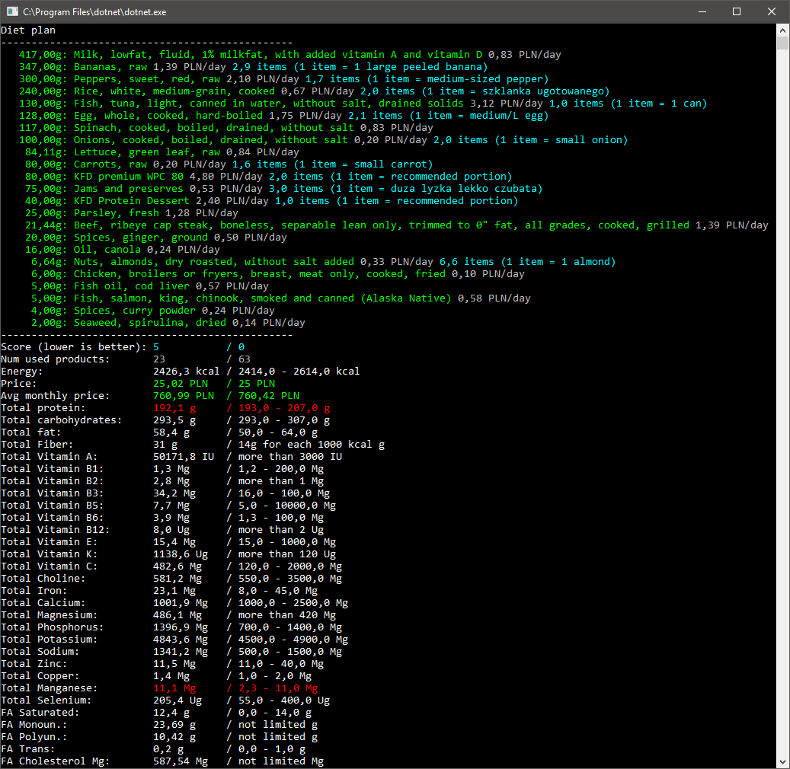

# Taurit.Toolkit

## About the project

This solution contains a set of small tools that help me simplify my everyday workflow.

They are not intended as generic solutions and will probably not be of any use (other than maybe inspiration ;)) to anyone else.

## Tool list

Currently the toolkit contains:

* __Taurit.Toolkit.CompressVideo__. Wrapper for _ffmpeg_ that allows to convert any video file into mp4 format (using x264 + AAC codecs). I have a shortcut for it on Total Commander's button bar, which allows me to convert files simply by dragging them into application's icon.

* __Taurit.Toolkit.ConvertToWebP__. Converts single file or all files in a directory to WebP format with a specific quality. Used as a part of drag&drop workflow that lets me convert files by dragging them to icons in Total Commander's icon bar.

* __Taurit.Toolkit.FixDateFormatInFilenames__. Fix date format in files generated by _Office Lens_ app. Because there is only one [correct format for dates](https://xkcd.com/1179/) and it's ISO 8601 ;)

* __Taurit.Toolkit.RemoveJpgFilesWhenCr2FilesExist__. Removes JPG (or JPEG) file if a file with the same name but extension 'CR2' is found in a directory. This is for removing preview files for photos dumped from Canon EOS camera.

* __Taurit.Toolkit.OptimizeRssForFeedly__. This app allows to enrich RSS feed with some metadata specific to [Feedly](https://feedly.com).

The following tools were moved to a separate repository:

* __Taurit.Toolkit.DietOptimization__. Library that allows me to find optimum diet for a given criteria.

* __Taurit.Toolkit.FindOptimalDiet__. Console interface to work with _Taurit.Toolkit.DietOptimization_ library. See screenshot below, as a picture is worth a thousand words.

